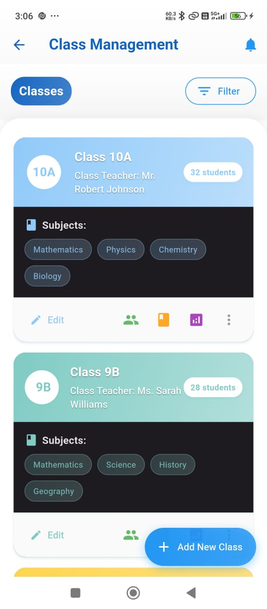
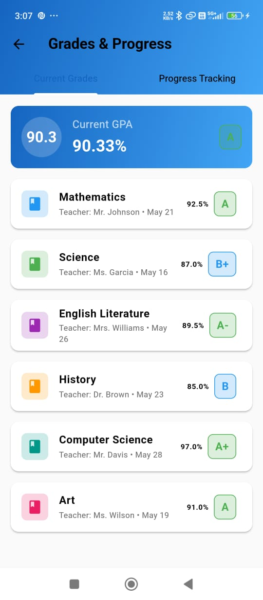

# 🏫 School Management App

<div align="center">
  <!-- Replace with your actual logo path or use a placeholder image URL -->
  
  <h3>A Comprehensive School Management Solution</h3>
  
  [](https://flutter.dev)
  [](https://dart.dev)
  [](LICENSE)
</div>

## 📋 Overview

The School Management App is a powerful mobile application designed to streamline educational operations by providing an integrated platform for administrators, teachers, students, and parents. This app aims to digitize various aspects of school management, from attendance tracking and grade management to communication between stakeholders.

## ✨ Key Features

### For School Administrators
- **Central Dashboard**: Get an overview of the entire school with statistical summaries
- **User Management**: Add and manage students, teachers, and parents
- **Class & Schedule Management**: Create and organize classes, subjects, and timetables
- **Academic Calendar**: Plan and publish school events, holidays, and exam schedules
- **Fee Management**: Track fee collections and manage payment statuses
- **Event Management**: Create and organize school events
- **Communication Hub**: Send announcements to specific user groups
- **Analytics**: Access insights and reports on school performance

### For Teachers
- **Class Management**: Access class lists and schedules
- **Attendance Tracking**: Mark and monitor student attendance
- **Assignment Creation**: Distribute and grade assignments
- **Performance Grading**: Record and manage student grades
- **Communication Tools**: Interact with students and parents

### For Students
- **Personal Dashboard**: View schedules, assignments, and grades
- **Academic Resources**: Access study materials
- **Assignment Submission**: View assigned tasks
- **Progress Tracking**: Monitor academic performance
- **Calendar Integration**: Stay updated on school events

### For Parents
- **Child-Centric Dashboard**: Track children's academic progress
- **Attendance Monitoring**: View detailed attendance records
- **Academic Performance**: Monitor grades and subject-wise performance
- **Fee Management**: Check payment status and history
- **Direct Communication**: Stay connected with teachers and administration

## 📱 Screenshots

### Role Selection & Authentication

<div align="center">
  <table>
    <tr>
      <!-- Use placeholder images until you have actual screenshots -->
      <td align="center"></td>
    </tr>
    <tr>
      <td align="center"><b>Role Selection</b></td>
    </tr>
  </table>
</div>

### Admin Interface

<div align="center">
  <table>
    <tr>
      <td align="center"></td>
      <td align="center"></td>
      <td align="center"></td>
      <td align="center"></td>
    </tr>
    <tr>
      <td align="center"><b>Admin Dashboard</b></td>
      <td align="center"><b>Class Management</b></td>
      <td align="center"><b>Teacher Management</b></td>
      <td align="center"><b>Student Management</b></td>
    </tr>
  </table>
</div>

### Teacher Interface

<div align="center">
  <table>
    <tr>
      <td align="center"></td>
      <td align="center"></td>
      <td align="center"></td>
    </tr>
    <tr>
      <td align="center"><b>Teacher Dashboard</b></td>
      <td align="center"><b>Assigment Screen</b></td>
      <td align="center"><b>Classes</b></td>
    </tr>
  </table>
</div>

### Student Interface

<div align="center">
  <table>
    <tr>
      <td align="center"></td>
      <td align="center"></td>
      <td align="center"></td>
      <td align="center"></td>
    </tr>
    <tr>
      <td align="center"><b>Student Dashboard</b></td>
      <td align="center"><b>Schedule View</b></td>
      <td align="center"><b>Grades View</b></td>
      <td align="center"><b>Form Submission</b></td>
    </tr>
  </table>
</div>

### Parent Interface

<div align="center">
  <table>
    <tr>
      <td align="center"></td>
      <td align="center"></td>
      <td align="center"></td>
      <td align="center"></td>
    </tr>
    <tr>
      <td align="center"><b>Parent Dashboard</b></td>
      <td align="center"><b>Fee Management</b></td>
      <td align="center"><b>Student Attandance</b></td>
      <td align="center"><b>Student Performance</b></td>
    </tr>
  </table>
</div>

## 🛠️ Technology Stack

- **Frontend**: Flutter SDK for cross-platform mobile development
- **Language**: Dart programming language
- **State Management**: Provider pattern
- **Styling**: Custom theme implementation with material design components
- **Navigation**: Named routes with arguments
- **Design Pattern**: Model-View-Controller (MVC)

## 📊 Architecture

The application is built following a clean architecture approach:
- **Models**: Data structures representing entities like users, classes, and events
- **Screens**: User interface components separated by user role
- **Services**: Business logic and API interaction layers
- **Utils**: Helper classes and utilities

## ⚙️ Dependencies

- `flutter`: The core framework
- `intl`: Internationalization and date formatting
- `table_calendar`: Calendar widget for academic scheduling
- `share_plus`: For sharing content from the application
- `pdf`: PDF generation for reports
- `path_provider`: File system access for saving reports

## 🚀 Getting Started

### Prerequisites
- Flutter SDK (v3.x or higher)
- Dart SDK (v3.x or higher)
- Android Studio / Visual Studio Code
- Android/iOS emulator or physical device

### Installation

1. Clone the repository
   ```bash
   git clone https://github.com/Ash469/school_management_app
   ```

2. Navigate to the project directory
   ```bash
   cd school_management_app
   ```

3. Install dependencies
   ```bash
   flutter pub get
   ```

4. Run the application
   ```bash
   flutter run
   ```

### Login Credentials (Demo)

For testing purposes, use the following credentials:

| Role | Email | Password |
|------|-------|----------|
| Admin | admin@example.com | password |
| Teacher | teacher@example.com | password |
| Student | student@example.com | password |
| Parent | parent@example.com | password |

## 📱 Supported Platforms

- Android
- iOS
- Web (future release)

## 🔮 Future Enhancements

- **Real-time Notifications**: Push notifications for important updates
- **Online Payment Gateway**: Integration for fee payments
- **Video Conferencing**: For virtual classes and meetings
- **Learning Management System**: For sharing educational resources
- **Offline Functionality**: Work with limited connectivity
- **Multi-language Support**: Interface translations for diverse user groups
- **Data Analytics Dashboard**: Advanced reporting tools
- **Library Management**: Digital library with book checkout system

## 📄 License

This project is licensed under the MIT License - see the [LICENSE](LICENSE) file for details.

## 👥 Contributors

- [Ayush Shandilya](https://github.com/Ash469) - Project Lead & Developer

## 🙏 Acknowledgements

- [Flutter Team](https://flutter.dev/team) for creating an amazing framework
- Icons from [Material Design](https://material.io/design)
- All the educators who provided valuable feedback during the development process

---

<div align="center">
  
  <p>Made with ❤️ for better school management</p>
</div>
